# Diagrama de Clases - Aplicación Swing de Restaurantes

Este documento contiene la descripción completa de las clases del proyecto, detallando sus superclases, interfaces implementadas, atributos principales, métodos y asociaciones. También se incluye un diagrama de clases visual interactivo en formato **Mermaid**.

---

## 1. Diagrama de Clases Visual (Mermaid)

```mermaid
classDiagram
    direction TB

    %% Clases del Mundo
    class Restaurante {
        -String nombre
        -int calificacion
        -int coordenadaX
        -int coordenadaY
        +boolean visitado
        +Restaurante(String nombre, int calificacion, int x, int y, boolean visitado)
        +getNombre() String
        +getCalificacion() int
        +getX() int
        +getY() int
        +isVisitado() boolean
        +toString() String
    }

    class Diario {
        -List~Restaurante~ restaurantes
        +Diario()
        +getRestaurantes(boolean completos) List~Restaurante~
        +agregarRestaurante(Restaurante restaurante) void
    }

    %% Interfaz Principal
    class VentanaPrincipal {
        -Diario mundo
        -PanelBotones pBotones
        -PanelDetallesRestaurante pDetalles
        -PanelLista pLista
        -VentanaMapa ventanaMapa
        -VentanaAgregarRestaurante ventanaAgregar
        +VentanaPrincipal(Diario elDiario)
        +mostrarVetanaNuevoRestaurante() void
        +mostrarVentanaMapa() void
        +agregarRestaurante(String nombre, int calificacion, int x, int y, boolean visitado) void
        +getRestaurantes(boolean completos) List~Restaurante~
        -actualizarRestaurantes() void
        +cambiarRestauranteSeleccionado(Restaurante seleccionado) void
        +main(String[] args)$ void
    }

    class PanelBotones {
        -JButton butNuevo
        -JButton butVerTodos
        -VentanaPrincipal ventanaPrincipal
        +PanelBotones(VentanaPrincipal ventanaPrincipal)
        +actionPerformed(ActionEvent e) void
    }

    class PanelDetallesRestaurante {
        -JLabel labNombre
        -JLabel labCalificacion
        -JCheckBox chkVisitado
        +PanelDetallesRestaurante()
        -actualizarRestaurante(String nombre, int calificacion, boolean visitado) void
        +actualizarRestaurante(Restaurante r) void
        -buscarIconoCalificacion(int calificacion) ImageIcon
    }

    class PanelLista {
        -JList~Restaurante~ listaDeRestaurantes
        -DefaultListModel~Restaurante~ dataModel
        -VentanaPrincipal ventanaPrincipal
        +PanelLista(VentanaPrincipal ventanaPrincipal)
        +actualizarRestaurantes(List~Restaurante~ restaurantes) void
        +valueChanged(ListSelectionEvent e) void
        +seleccionarRestaurante(Restaurante restaurante) void
    }

    %% Interfaz Mapa
    class VentanaMapa {
        -PanelMapaVisualizar panelMapa
        -JRadioButton radioTodos
        -JRadioButton radioVisitados
        -VentanaPrincipal ventanaPrincipal
        +VentanaMapa(VentanaPrincipal ventanaPrincipal, List~Restaurante~ restaurantes)
        +actionPerformed(ActionEvent e) void
    }

    class PanelMapaVisualizar {
        -JLabel labMapa
        -List~Restaurante~ restaurantes
        +PanelMapaVisualizar(List~Restaurante~ iniciales)
        +paint(Graphics g) void
        +actualizarMapa(List~Restaurante~ nuevosRestaurantes) void
    }

    %% Interfaz Agregar Restaurante
    class VentanaAgregarRestaurante {
        -PanelEditarRestaurante panelDetalles
        -PanelBotonesAgregar panelBotones
        -PanelMapaAgregar panelMapa
        -VentanaPrincipal ventanaPrincipal
        +VentanaAgregarRestaurante(VentanaPrincipal principal)
        +agregarRestaurante() void
        +cerrarVentana() void
    }

    class PanelBotonesAgregar {
        -JButton butNuevo
        -JButton butCerrar
        -VentanaAgregarRestaurante ventanaPrincipal
        +PanelBotonesAgregar(VentanaAgregarRestaurante ventanaPrincipal)
        +actionPerformed(ActionEvent e) void
    }

    class PanelEditarRestaurante {
        -JTextField txtNombre
        -JComboBox~String~ cbbCalificacion
        -JComboBox~String~ cbbVisitado
        +PanelEditarRestaurante()
        +getVisitado() boolean
        +getCalificacion() int
        +getNombre() String
    }

    class PanelMapaAgregar {
        -JLabel labMapa
        -int x
        -int y
        +PanelMapaAgregar()
        +getCoordenadas() int[]
        +paint(Graphics g) void
        +mouseClicked(MouseEvent e) void
        +mousePressed(MouseEvent e) void
        +mouseReleased(MouseEvent e) void
        +mouseEntered(MouseEvent e) void
        +mouseExited(MouseEvent e) void
    }

    %% Interfaces
    class ActionListener {
        <<interface>>
        +actionPerformed(ActionEvent e)* void
    }
    class ListSelectionListener {
        <<interface>>
        +valueChanged(ListSelectionEvent e)* void
    }
    class MouseListener {
        <<interface>>
        +mouseClicked(MouseEvent e)* void
        +mousePressed(MouseEvent e)* void
        +mouseReleased(MouseEvent e)* void
        +mouseEntered(MouseEvent e)* void
        +mouseExited(MouseEvent e)* void
    }

    %% Swing/AWT Superclasses (Jerarquía de Herencia)
    class JFrame {
        <<Swing>>
    }
    class JPanel {
        <<Swing>>
    }

    %% Relaciones de Herencia
    JFrame <|-- VentanaPrincipal
    JFrame <|-- VentanaMapa
    JFrame <|-- VentanaAgregarRestaurante

    JPanel <|-- PanelBotones
    JPanel <|-- PanelDetallesRestaurante
    JPanel <|-- PanelLista
    JPanel <|-- PanelMapaVisualizar
    JPanel <|-- PanelBotonesAgregar
    JPanel <|-- PanelEditarRestaurante
    JPanel <|-- PanelMapaAgregar

    %% Relaciones de Realización (Interfaces)
    ActionListener <|.. PanelBotones
    ActionListener <|.. VentanaMapa
    ActionListener <|.. PanelBotonesAgregar
    ListSelectionListener <|.. PanelLista
    MouseListener <|.. PanelMapaAgregar

    %% Relaciones de Asociación / Composición / Agregación
    Diario "1" o-- "*" Restaurante : restaurantes
    VentanaPrincipal "1" *-- "1" PanelBotones : pBotones
    VentanaPrincipal "1" *-- "1" PanelDetallesRestaurante : pDetalles
    VentanaPrincipal "1" *-- "1" PanelLista : pLista
    VentanaPrincipal "1" o-- "0..1" VentanaMapa : ventanaMapa
    VentanaPrincipal "1" o-- "0..1" VentanaAgregarRestaurante : ventanaAgregar
    VentanaPrincipal "1" --> "1" Diario : mundo

    PanelBotones "1" --> "1" VentanaPrincipal : ventanaPrincipal
    PanelLista "1" --> "1" VentanaPrincipal : ventanaPrincipal
    VentanaMapa "1" --> "1" VentanaPrincipal : ventanaPrincipal
    VentanaMapa "1" *-- "1" PanelMapaVisualizar : panelMapa
    PanelMapaVisualizar "1" o-- "*" Restaurante : restaurantes

    VentanaAgregarRestaurante "1" *-- "1" PanelEditarRestaurante : panelDetalles
    VentanaAgregarRestaurante "1" *-- "1" PanelBotonesAgregar : panelBotones
    VentanaAgregarRestaurante "1" *-- "1" PanelMapaAgregar : panelMapa
    VentanaAgregarRestaurante "1" --> "1" VentanaPrincipal : ventanaPrincipal

    PanelBotonesAgregar "1" --> "1" VentanaAgregarRestaurante : ventanaPrincipal
```

---

## 2. Detalle de Clases

A continuación se presenta el detalle de cada clase organizada por paquete, especificando su superclase, interfaces implementadas y asociaciones.

### Paquete `uniandes.dpoo.swing.mundo`

#### `Restaurante`
- **Superclase**: `Object` (implícita)
- **Interfaces**: Ninguna
- **Asociaciones**: Ninguna
- **Responsabilidad**: Representa la información individual de un restaurante (nombre, calificación, coordenadas X y Y, y si ha sido visitado).

#### `Diario`
- **Superclase**: `Object` (implícita)
- **Interfaces**: Ninguna
- **Asociaciones**:
  - `restaurantes`: Agregación de tipo `List<Restaurante>` (1 a muchos).
- **Responsabilidad**: Administra la lista de restaurantes en el diario (permite agregarlos y filtrar los visitados o todos).

---

### Paquete `uniandes.dpoo.swing.interfaz.principal`

#### `VentanaPrincipal`
- **Superclase**: `javax.swing.JFrame`
- **Interfaces**: Ninguna
- **Asociaciones**:
  - `mundo`: Asociación simple (1 a 1) con `Diario`.
  - `pBotones`: Composición (1 a 1) con `PanelBotones`.
  - `pDetalles`: Composición (1 a 1) con `PanelDetallesRestaurante`.
  - `pLista`: Composición (1 a 1) con `PanelLista`.
  - `ventanaMapa`: Agregación/Asociación opcional (0 a 1) con `VentanaMapa`.
  - `ventanaAgregar`: Agregación/Asociación opcional (0 a 1) con `VentanaAgregarRestaurante`.
- **Responsabilidad**: Ventana principal que coordina toda la aplicación, comunica los subpaneles con el modelo lógico (`Diario`) y gestiona las aperturas de otras ventanas secundarias.

#### `PanelBotones`
- **Superclase**: `javax.swing.JPanel`
- **Interfaces**: `java.awt.event.ActionListener`
- **Asociaciones**:
  - `ventanaPrincipal`: Asociación simple (1 a 1) con `VentanaPrincipal`.
- **Responsabilidad**: Panel superior que contiene los botones para abrir la ventana de mapa o crear un nuevo restaurante, delegando los eventos a `VentanaPrincipal`.

#### `PanelDetallesRestaurante`
- **Superclase**: `javax.swing.JPanel`
- **Interfaces**: Ninguna
- **Asociaciones**:
  - Dependencia temporal con `Restaurante` al actualizar los detalles.
- **Responsabilidad**: Panel inferior que muestra el nombre, calificación (mediante un ícono de estrellas) y estado de visita del restaurante seleccionado actualmente.

#### `PanelLista`
- **Superclase**: `javax.swing.JPanel`
- **Interfaces**: `javax.swing.event.ListSelectionListener`
- **Asociaciones**:
  - `ventanaPrincipal`: Asociación simple (1 a 1) con `VentanaPrincipal`.
  - Dependencia con `Restaurante` ya que los contiene dentro de `JList<Restaurante>` y `DefaultListModel<Restaurante>`.
- **Responsabilidad**: Panel central que muestra la lista de restaurantes en un componente scroll y notifica a la ventana principal cuando se selecciona un restaurante diferente.

---

### Paquete `uniandes.dpoo.swing.interfaz.mapa`

#### `VentanaMapa`
- **Superclase**: `javax.swing.JFrame`
- **Interfaces**: `java.awt.event.ActionListener`
- **Asociaciones**:
  - `panelMapa`: Composición (1 a 1) con `PanelMapaVisualizar`.
  - `ventanaPrincipal`: Asociación simple (1 a 1) con `VentanaPrincipal`.
- **Responsabilidad**: Ventana secundaria que contiene el mapa de visualización de restaurantes y los radio buttons para filtrar cuáles se muestran (todos o sólo visitados).

#### `PanelMapaVisualizar`
- **Superclase**: `javax.swing.JPanel`
- **Interfaces**: Ninguna
- **Asociaciones**:
  - `restaurantes`: Agregación de tipo `List<Restaurante>` (1 a muchos).
- **Responsabilidad**: Dibuja el mapa geográfico en un `JLabel` y sobrescribe el método `paint` para dibujar círculos rojos y los nombres en las posiciones correspondientes de los restaurantes en la lista.

---

### Paquete `uniandes.dpoo.swing.interfaz.agregar`

#### `VentanaAgregarRestaurante`
- **Superclase**: `javax.swing.JFrame`
- **Interfaces**: Ninguna
- **Asociaciones**:
  - `panelDetalles`: Composición (1 a 1) con `PanelEditarRestaurante`.
  - `panelBotones`: Composición (1 a 1) con `PanelBotonesAgregar`.
  - `panelMapa`: Composición (1 a 1) con `PanelMapaAgregar`.
  - `ventanaPrincipal`: Asociación simple (1 a 1) con `VentanaPrincipal`.
- **Responsabilidad**: Ventana secundaria tipo formulario que recopila los datos del nuevo restaurante (nombre, calificación, visita y ubicación en el mapa) y los envía a `VentanaPrincipal` para su almacenamiento.

#### `PanelBotonesAgregar`
- **Superclase**: `javax.swing.JPanel`
- **Interfaces**: `java.awt.event.ActionListener`
- **Asociaciones**:
  - `ventanaPrincipal`: Asociación simple (1 a 1) con `VentanaAgregarRestaurante`.
- **Responsabilidad**: Contiene los botones de "Crear" y "Cerrar" del formulario de creación y delega su procesamiento a la ventana contenedora.

#### `PanelEditarRestaurante`
- **Superclase**: `javax.swing.JPanel`
- **Interfaces**: Ninguna
- **Asociaciones**: Ninguna
- **Responsabilidad**: Panel de campos de texto y comboboxes donde el usuario ingresa el nombre del nuevo restaurante, su calificación y si ha sido visitado.

#### `PanelMapaAgregar`
- **Superclase**: `javax.swing.JPanel`
- **Interfaces**: `java.awt.event.MouseListener`
- **Asociaciones**: Ninguna
- **Responsabilidad**: Muestra el mapa y captura los eventos de clic del mouse para definir y pintar la ubicación (coordenadas X, Y) donde se desea crear el nuevo restaurante.
